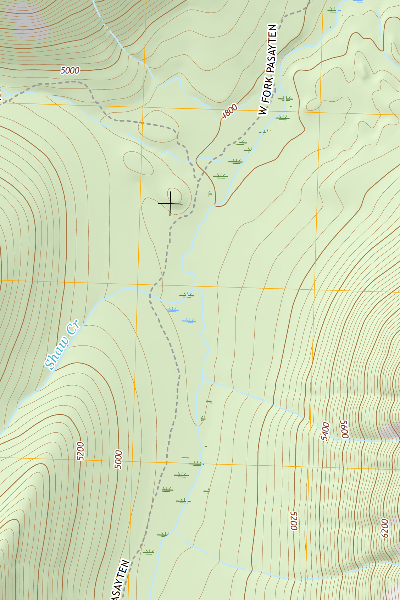
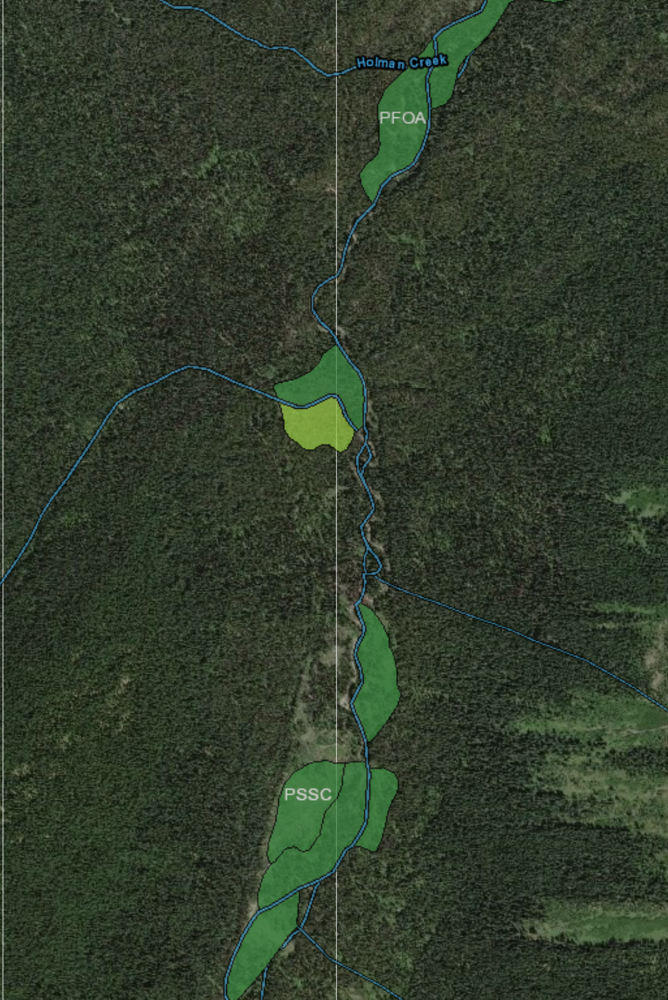

# vector-nationalmap
Exploration of using US National Map data with OpenMapTiles

## Overview

1. Download vector data sources from USGS website
    - This can either be large state-level data or only the data within a
      quadrangle. Downloading a quad-level GDB file, i.e. from
      [here](https://prd-tnm.s3.amazonaws.com/index.html?prefix=StagedProducts/TopoMapVector/WA/GDB/)
      has essentially all the data that makes up the rendered GeoPDF file.
2. Extract feature layers into GeoJSON files, only keeping necessary attributes
3. Use tippecanoe to convert the GeoJSON files into vector tiles
4. Create a `tile.json` file to specify where your data are
5. Create a `style.json` that references the `tile.json` to give styling to the
    map, ideally making it as close as possible to USGS Quads.

## Notes

Columns to keep from each data source:

| Layer Name           | Attributes                                                      |
|----------------------|-----------------------------------------------------------------|
| `Elev_Contour`       | `FCode`, `ContourElevation`                                     |
| `NHDWaterbody`       | `FCode`                                                         |
| `NHDFlowline`        | `FCode`                                                         |
| `NHDPoint`           | `FCode`                                                         |
|                      |                                                                 |
|                      |                                                                 |
|                      |                                                                 |
| `LANDCOVER_WOODLAND` | None?, `FCODE`?                                                 |
| `GU_Reserve`         | `FCode`                                                         |
| `TNMDerivedNames`    | `GAZ_NAME`, `GAZ_FEATURECLASS`, `FEATURE_CODE`, `GAZ_ELEVATION` |
|                      |                                                                 |
| `Trans_TrailSegment` | `NAME`, `FCODE`                                                 |

## Questions

- Find an FCODE reference for the National Transportation Dataset
- Is there any FCode other than `20602` in `Trans_TrailSegment`?

## To Do

- Make trail names sentence case
- Figure out non-woodland land cover FCodes, like sand, glacier
- Wilderness boundary line
- Wetlands data: [FWS state downloads](https://www.fws.gov/wetlands/Data/State-Downloads.html); [Washington State](http://128.104.224.198/State-Downloads/WA_geodatabase_wetlands.zip)

    Note that there are two different colors of marsh on the USGS topo maps.  This appears to match the FWS data (the blue flowers on the USGS topo are where the brighter yellow polygon is). 

- So far, have only checked TNMDerivedNames GAZ_FEATURECLASS: Summit, Gap, Populated Place, Ridge, Basin
- For summits, add elevation
- Deal with road segments

## References

[Helpful list for NHD FCode values](https://nhd.usgs.gov/userGuide/Robohelpfiles/NHD_User_Guide/Feature_Catalog/Hydrography_Dataset/Complete_FCode_List.htm)
